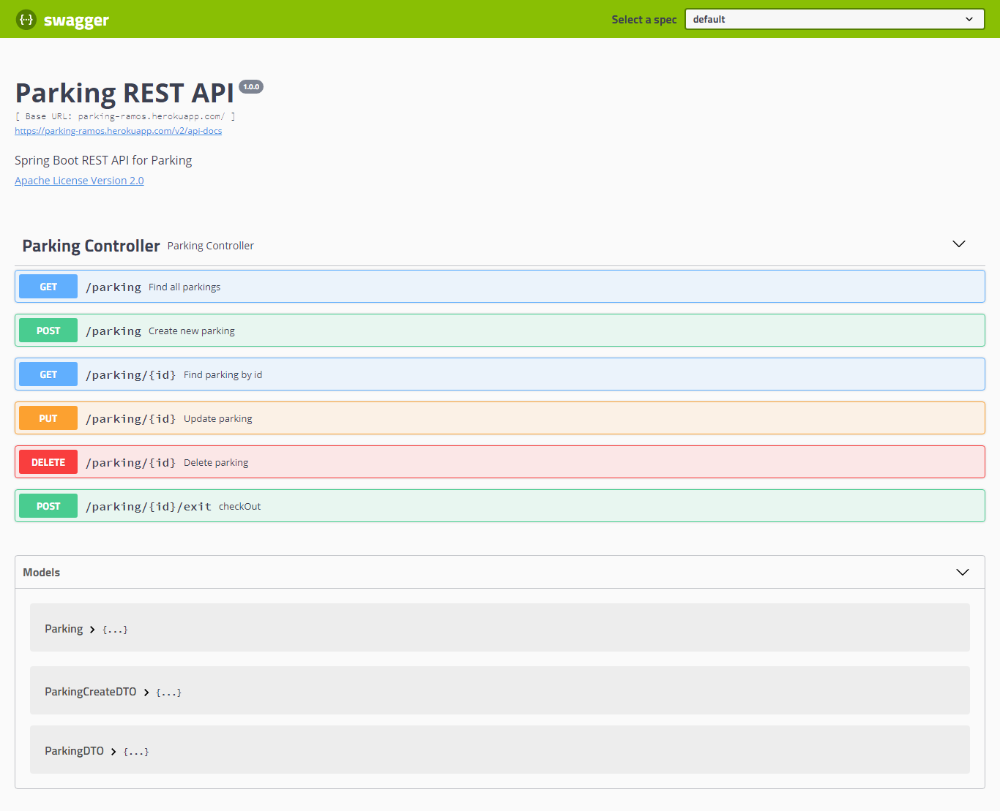

# Cloud Parking


REST API para controle de estacionamento de carros

## Project features

- `features 1`: Obtem todos os veículos estacionados
- `features 2`: Obtem somente um veículo estacionado através do ID
- `features 3`: Criação de novos veículos estacionados
- `features 4`: Atualização de dados do veículo estacionado
- `features 5`: Calcula o valor a ser pago quando o veículo dá baixa no estacionamento
- `features 6`: Deleta os dados do veículo passando o ID




## Getting Started
Para executar o projeto, será necessário instalar os seguintes programas:
<ul>
  <li>JDK 11</li>
  <li>Maven 4</li>
  <li>Um editor dde sua preferência</li>
</ul>

## Development
Para iniciar o desenvolvimento, é necessário clonar o projeto do GitHub num diretório de sua preferência:
```shell
cd "diretorio de sua preferencia"
git clone https://github.com/dgleyramos1/cloud-parking.git
```

## Build
Para construir o projeto com o Maven, executar os comando abaixo:

```shell
mvn clean install
```

O comando irá baixar todas as dependências do projeto e criar um diretório *target* com os artefatos construídos, que incluem o arquivo jar do projeto. Além disso, serão executados os testes unitários, e se algum falhar, o Maven exibirá essa informação no console.

## Tests

Para rodar os testes, utilize o comando abaixo:

```shell
mvn test
```

## Routes

Documentação com Swagger
```
/swagger-ui.html
```

GET -> Find All Parkings
```
/parking
```
GET -> Find Parking By Id
```
/parking/{id}
```
POST -> Create New Parking
```
/parking
```
PUT -> Update Parking
```
/parking/{id}
```
POST -> Parking exit validation
```
/parking/{id}/exit
```
DELETE -> Delete Parking
```
/parking/{id}
```

## Models
### Parking
* id: String
* color: String
* license: String
* model: Stirng
* state: String
* entryDate: date-time
* exitDate: date-time
* bill: Double

### ParkingCreateDTO
* color: String
* license: String
* model: Stirng
* state: String

### ParkingDTO
* color: String
* license: String
* model: Stirng
* state: String
* entryDate: date-time
* exitDate: date-time
* bill: Double

## Contributions

Contribuições são sempre bem-vindas! Para contribuir lembre-se sempre de adicionar testes unitários para as novas classes com a devida documentação.

## Links
* Documentação: [Doc](ttps://parking-ramos.herokuapp.com/swagger-ui.html})

## License
* [GNU](https://github.com/dgleyramos1/cloud-parking/blob/main/LICENSE.md)

## Author
Dgley Ramos
[LinkedIn](https://www.linkedin.com/in/dgleyramos/)


<p><a href="https://www.buymeacoffee.com/dgleyramos"> </a></p><br><br>
